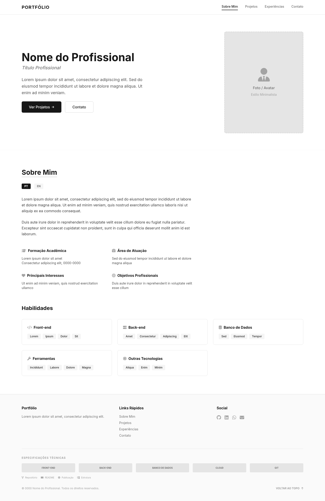
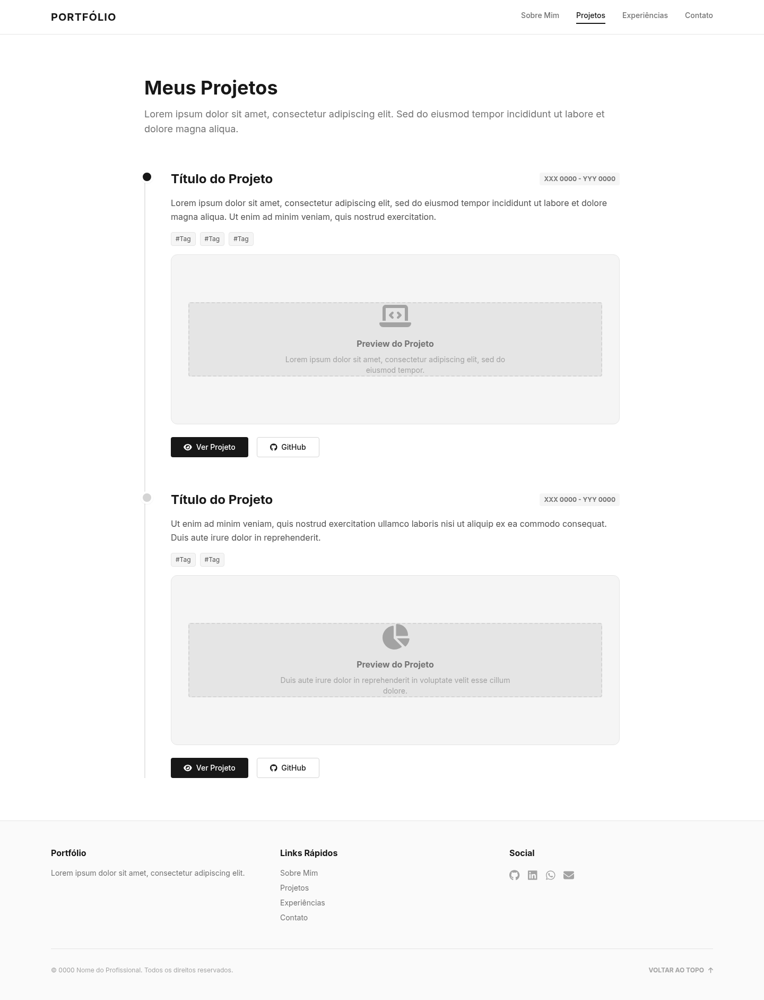
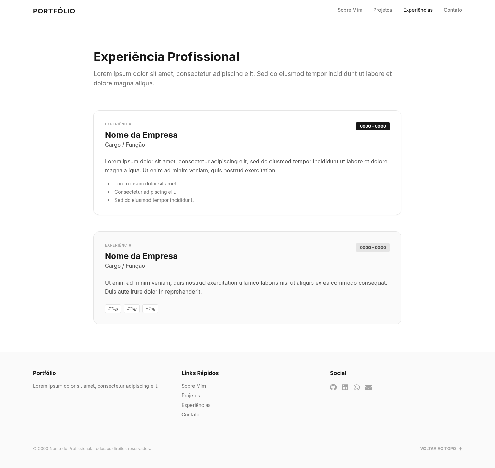
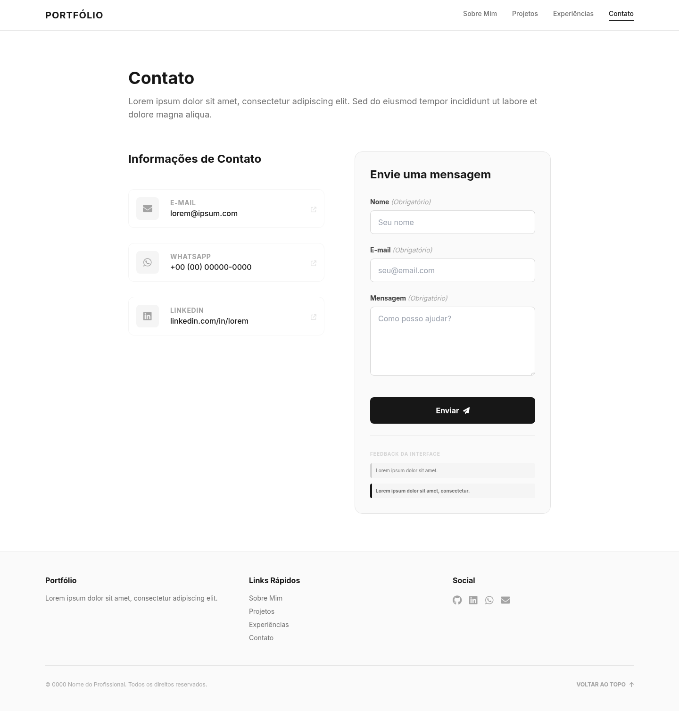

# Portfólio Profissional - Gabriel Silva Neiva Amaro

Projeto desenvolvido para a disciplina de **Projeto de Software** (Laboratório 1). 
Trata-se de um website de portfólio profissional dinâmico, responsivo e bilíngue (Português/Inglês) para apresentar trajetória, habilidades, projetos e formas de contato.

🌍 **Link da aplicação hospedada (Vercel):** [https://pagina-de-portfolio-gabriel.vercel.app](<SUA_URL_DA_VERCEL_AQUI>)

---

## 🛠️ Tecnologias e Bibliotecas Utilizadas

**Front-end:**
- **React.js** (Criado via Vite)
- **Tailwind CSS v4** (Estilização responsiva e ágil)
- **EmailJS** (Integração de envio de emails sem necessidade de um backend próprio)
- **Lucide React** (Pacote de ícones SVG - *caso utilizado*)

**Linguagens e Ferramentas:**
- JavaScript / JSX
- Node.js & npm

---

## 📂 Estrutura de Diretórios

```
lds-lab1/
├── front/
│   ├── public/              # Assets estáticos (ex: imagens dos projetos)
│   ├── src/                 # Código-fonte da aplicação React
│   │   ├── components/      # Componentes de interface (Páginas, Navbar, Footer)
│   │   │   ├── resumeData.js      # Dados do currículo (PT/EN) e projetos
│   │   │   ├── ContactPage.jsx    # Página de Contato e lógica do EmailJS
│   │   │   ├── ProjectsPage.jsx   # Linha do tempo e carrossel de projetos
│   │   │   └── ...
│   │   ├── App.jsx          # Componente raiz
│   │   └── main.jsx         # Ponto de entrada do React
│   ├── package.json         # Dependências do projeto
│   └── vite.config.js       # Configurações do empacotador Vite
├── img/                     # Wireframes e protótipos das telas da aplicação
└── README.md                # Documentação do projeto
```

---

## 🚀 Como instalar e executar localmente

Siga os passos abaixo para rodar a aplicação na sua máquina:

1. **Clone o repositório:**
   ```bash
   git clone https://github.com/gabrielsnamaro/pagina-de-portfolio.git
   cd pagina-de-portfolio/front
   ```

2. **Instale as dependências:**
   Certifique-se de ter o [Node.js](https://nodejs.org/) instalado.
   ```bash
   npm install
   ```

3. **Configuração de Variáveis de Ambiente:**
   Crie um arquivo `.env` na pasta `front/` seguindo o modelo do `.env.example` para que o formulário de contato funcione via EmailJS:
   ```env
   VITE_EMAILJS_SERVICE_ID=seu_service_id
   VITE_EMAILJS_TEMPLATE_ID=seu_template_id
   VITE_EMAILJS_PUBLIC_KEY=sua_public_key
   ```

4. **Inicie o servidor de desenvolvimento:**
   ```bash
   npm run dev
   ```
   Acesse a aplicação no seu navegador: `http://localhost:5173`.

---

## 🎨 Wireframes e Protótipos

Abaixo estão os wireframes de média fidelidade elaborados durante a etapa de planejamento e design do sistema (Lab01S01):

### Página Inicial (Sobre Mim)


### Meus Projetos
*Esboço da seção de projetos, incluindo a disposição em linha do tempo.*


### Experiência Profissional


### Contato

